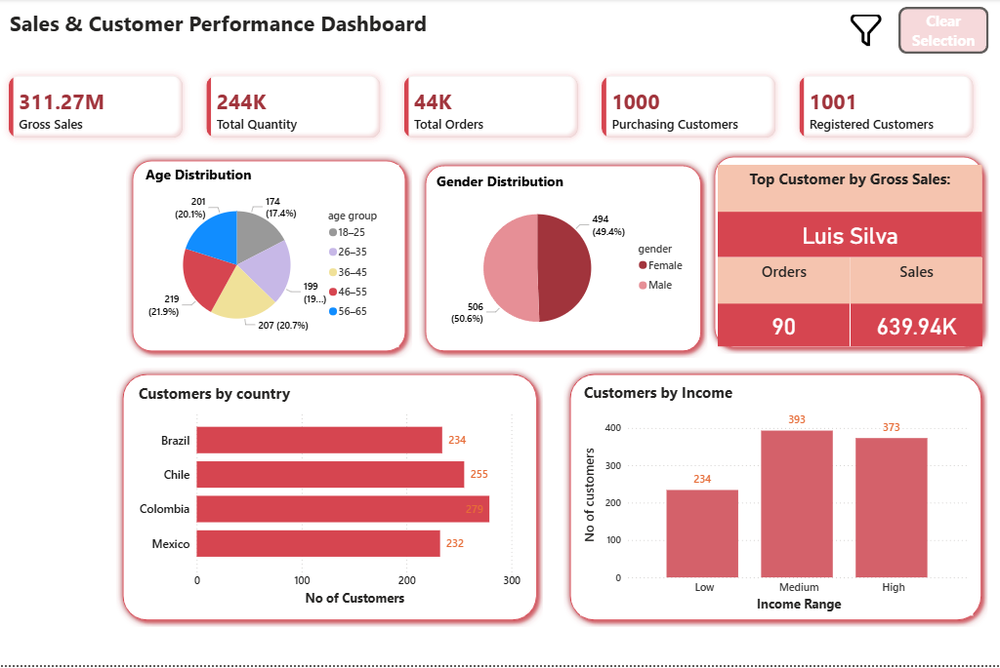
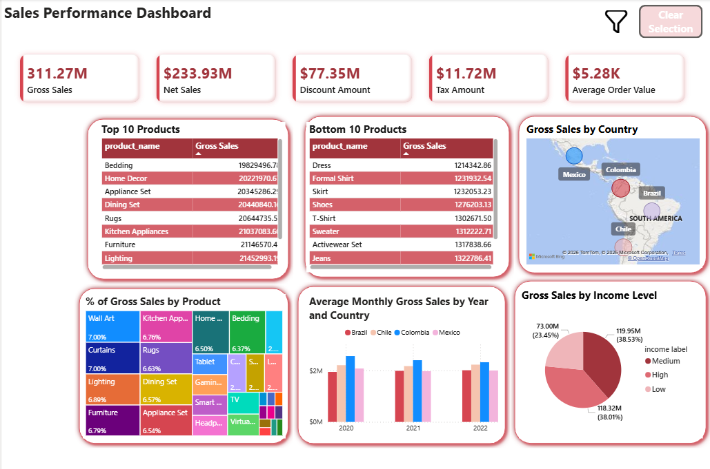
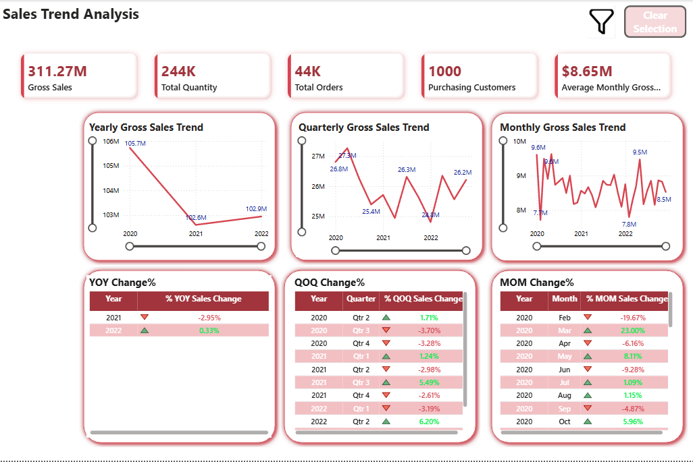
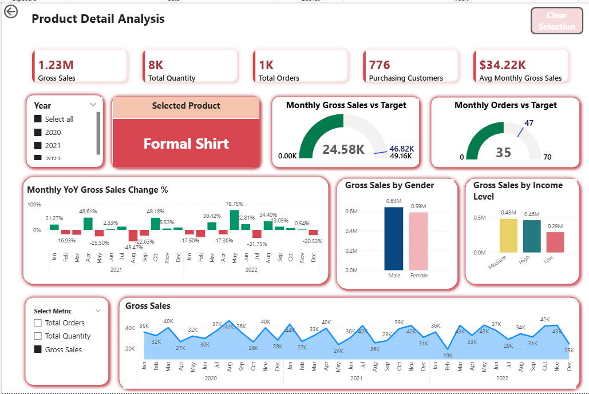

# Sales & Customer Performance Analysis

## Project Overview

This Power BI project analyses customer demographics, product performance, sales trends, discounts, taxes, and order activity across Brazil, Chile, Colombia, and Mexico from 2020 to 2022.

The dashboard helps users understand:

- Customer distribution and income segments
- Gross and net sales performance
- Product rankings
- Monthly, quarterly, and yearly sales trends
- Sales growth compared with previous periods
- Product-level performance and sales targets

## Tools Used

- Power BI
- Power Query
- DAX
- CSV data files

## Dataset

The project uses two main datasets:

- Customer data: 1,001 registered customers
- Sales data: 44,342 orders

## Data Preparation

Power Query was used to:

- Correct data types
- Trim text columns
- Remove duplicate records
- Merge customer names
- Create age groups
- Create income classifications
- Parse date columns using the correct locale
- Calculate shipping duration
- Validate missing values and errors

## Data Model

The model uses a star-schema structure:

- `Customer` → `Sales`
- `dDate` → `Sales`
- `Measures Table` for DAX measures
- `Field Selection Parameter` for dynamic metric selection

Both relationships are one-to-many with single-direction filtering.

## Key Measures

- Gross Sales
- Discount Amount
- Net Sales
- Tax Amount
- Sales Including Tax
- Total Orders
- Total Quantity
- Purchasing Customers
- Registered Customers
- Average Order Value
- Average Monthly Gross Sales
- Previous Month Sales
- Previous Quarter Sales
- Previous Year Sales
- Month-over-Month Sales Change
- Quarter-over-Quarter Sales Change
- Year-over-Year Sales Change
- Monthly Sales Target

## Dashboard Pages

### 1. Customer Demographic

Analyses customers by:

- Age group
- Gender
- Country
- Income level
- Top customer by gross sales



### 2. Sales Performance

Analyses:

- Gross sales
- Net sales
- Discount amount
- Tax amount
- Average order value
- Top and bottom products
- Gross sales by country
- Gross sales by income level
- Product contribution to total sales



### 3. Time Series

Shows:

- Yearly gross sales trend
- Quarterly gross sales trend
- Monthly gross sales trend
- Month-over-month change
- Quarter-over-quarter change
- Year-over-year change



### 4. Product Detail

Provides drill-through analysis for individual products, including:

- Product-level KPIs
- Monthly sales and order targets
- Gross sales by gender and income level
- Monthly YoY sales change
- Dynamic metric selection
- Monthly performance trend



## Key Results

- Gross Sales: approximately $311.27M
- Net Sales: approximately $233.93M
- Discount Amount: approximately $77.35M
- Total Orders: 44,342
- Total Quantity: approximately 244K
- Purchasing Customers: 1,000
- Registered Customers: 1,001
- Average Order Value: approximately $5.28K
- 2021 gross sales decreased by approximately 2.95% compared with 2020.
- 2022 gross sales increased slightly by approximately 0.33% compared with 2021.

## Interactive Features

- Product drill-through
- Report-page tooltip
- Dynamic metric field parameter
- Year slicer
- Clear-selection buttons
- Cross-filtering between visuals
- Conditional formatting for growth measures

## Folder Structure

```text
Sales_Customer_Performance_Analysis/
├── data/
├── powerbi/
├── screenshots/
└── README.md